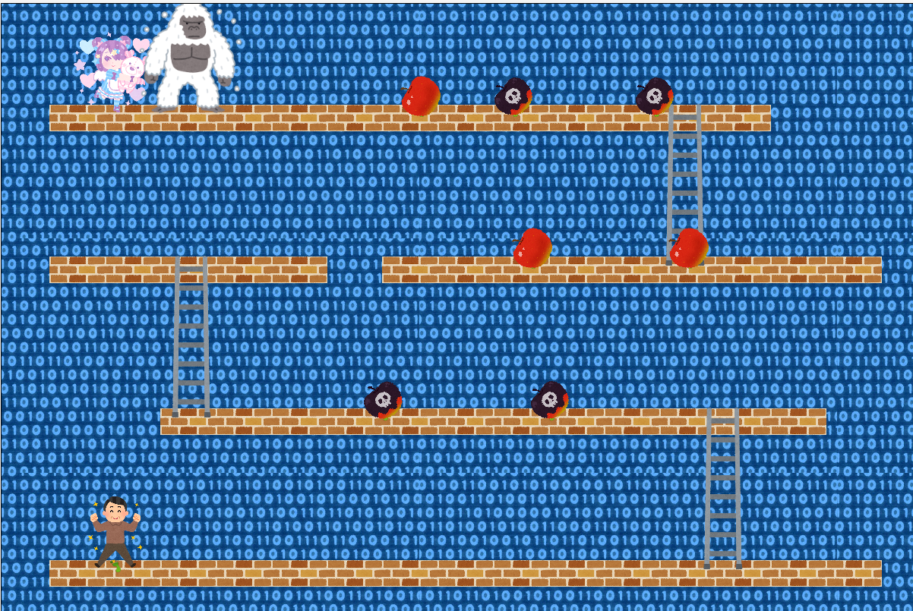

*マークダウンでマニュアル作成*
# DonK-Kong

## 1.あらすじ
>> 時は20XX年、サイバーゴリッラて世界中の女性がさらわれてしまった。  
>> そこで立ち上がったサイバー配管工M〇RI〇。
>> 今、一人のサイバー配管工の戦いが始まる。

## 2.登場キャラクター
  > - サイバー配管工(♂):サイバー配管工の♂の姿、**見た目だけでメスと変わらない。**  
      
  > - サイバー配管工(♀):サイバー配管工の♀の姿。  
        
  > - サイバーゴリッラ:世界中の女性をさらう悪い奴。**女に飢えている。**  
        

## 3.ゲーム内容
   > - スタート画面  
      
   > - プレイ画面  
      
   >> - Fボタン:サイバー配管工(♀)  
        Mボタン:サイバー配管工(♂)  
        に切り替えられる。
   >>  - 毒リンゴを避けながら、**サイバーゴリッラの場所を目指す。**  
       梯子を登ることで、上の段に移動できる。  
   >>  - 毒リンゴに当たるとHPが減る。  
       リンゴに当たるとHPが回復する。  
   >>  - HPが0になる、またはtimeが0になるとゲームオーバー  
   >>  - サイバーゴリッラのもとにたどり着くとゲームクリア  
   >>  - 操作方法  
       - ←→キーで横移動  
       - ↑キーでジャンプ  
   > - クリア画面  
        
   > - ゲームオーバー画面  
       

#### 開発者
   > - ディレクター：佐藤歩夢  
   > - 企画：佐藤歩夢  
   > - プログラム：佐藤拓実,神原早紀
   > - マニュアル作成：佐藤歩夢  
       
       
